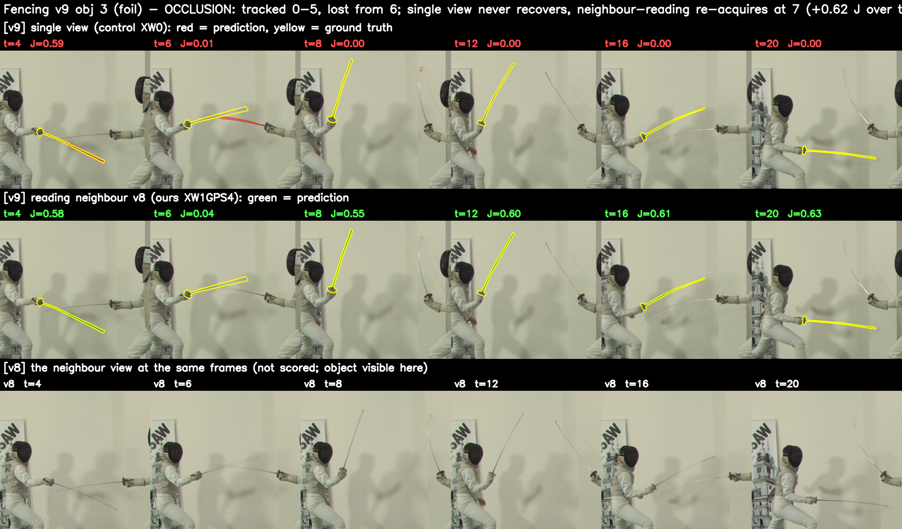
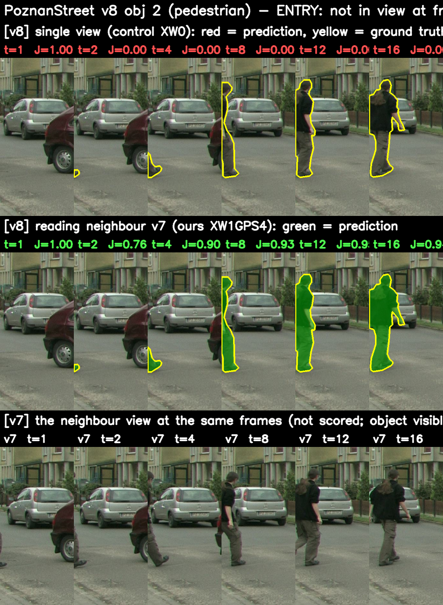
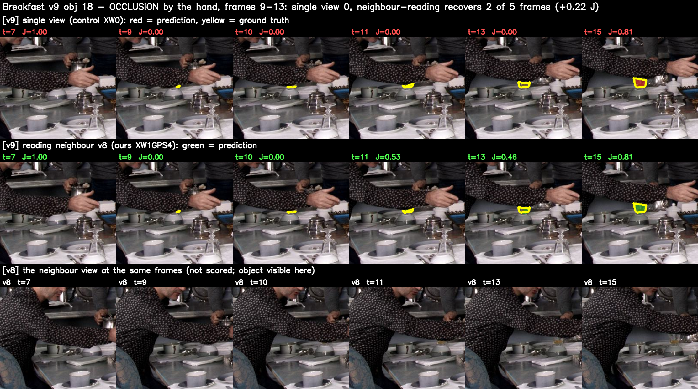

# E3 결과 — 추적 중 이웃 읽기는 놓친 객체를 되찾는다: 지지되나 검정력 부족

> 사전 등록 [xview-recovery-prereg.md](xview-recovery-prereg.md)(cd612f8)의 정의와 판정을 그대로 읽은
> 결과입니다. 스크립트 `eval/xview_recovery.py`, GPU 0, 2026-09-09.

## 0. 한 줄 요약

이 벤치마크에서 단일 시점 추적기가 3프레임 이상 놓치고 이웃 읽기 쪽이 잡고 있는 **갈림 구간은 셋**이고,
셋 다 이웃 읽기 쪽이 되찾았으며 반대 방향(이웃 읽기가 만든 새 유실)은 **0**입니다. 기준 카메라를 바꿔도
**같은 세 사건이 같은 프레임에서** 나타나고 같은 방식으로 되찾힙니다 — 사건은 영상의 성질이고 회복은
시드에 무관합니다. 다만 사건이 셋뿐이라 등록 판정은 **"지지·검정력 부족"**입니다. 확인된 주장으로는
쓰지 않고, 벤치마크가 이 메커니즘을 거의 시험하지 않는다는 사실과 함께 적습니다.

## 1. 읽기

| 읽기 | 데이터 | 갈림 구간 | 되찾음 | 새 유실 | 양측 p | 등록 판정 |
|---|---|---|---|---|---|---|
| 발견 (이미 봄) | c_ini, 17장면, GPS4M − XW0M | 3 | 3 | 0 | 0.25 | — |
| **1차 검증** | max-id 기준, 17장면, GPS4 − XW0 | 3 | 3 | 0 | 0.25 | **지지·검정력 부족** |
| 보조 ② 순수 채널 | max-id 기준, 15장면, XW1 − XW0 | 4 | 3 | 1 | 0.63 | 미확인 |
| 보조 ④ 겹침 | 발견 ∩ 검증 | **3/3** | | | | 합산 무효 |

감시값(이웃 없는 카메라의 갈림 구간 = 0)은 세 읽기 모두 통과했습니다.

**보조 ①(합산 6 대 0, p = 0.031)은 쓰지 않습니다.** 겹침이 3/3이므로 같은 사건을 두 번 센 것입니다.
바로 이것을 잡으려고 겹침 읽기를 미리 선언해 두었습니다.

### 세 사건

| 사건 | 종류 | 프레임 | 대조군 | 이웃 읽기 | 구간 J 이득 |
|---|---|---|---|---|---|
| PoznanStreet v8 obj 2 | **진입** — 첫 프레임에 없다가 프레임 2에 시야로 들어옴 | 2~16 | 15프레임 내내 못 잡음(17에야 잡음) | 들어오는 순간부터 15/15 잡음 | +0.90 |
| Fencing v9 obj 3 | **가림** — 0~5 잡다가 6부터 놓침 | 6~20 | 끝까지 놓침 | 7부터 되찾아 14/15 | +0.62 |
| Breakfast v9 obj 18 | **가림** | 9~13 | 놓침 | 2/5 잡음 | +0.22 |

두 종류가 다 있습니다. 진입은 첫 프레임 시드가 원리상 담을 수 없는 경우이고, 가림은 시드가 완벽해도
생기는 경우입니다. 세 사건의 프레임 그림 — 위: 단일 시점(빨강 = 예측, 노랑 = 정답), 가운데: 이웃 읽기
(초록), 아래: 그 기억을 준 이웃 카메라의 같은 프레임(채점 대상이 아니라 마스크 없음, 객체가 보인다는 것만):

Fencing에서는 두 선수가 교차하는 t=6에 검을 잃고 단일 시점은 끝까지 되찾지 못하는데, 이웃 v8에는 검이
내내 보이고 이웃 읽기는 t=8부터 되찾습니다. PoznanStreet에서는 t=2에 왼쪽에서 들어오는 보행자를 단일
시점은 16프레임 내내 잡지 못하고, 이웃 읽기는 들어오는 순간부터 잡습니다. 둘 다 옆 시점이 넘겨주는 것 말고는 그 카메라가 잡을 길이 없습니다.

### 시드에 무관함

발견 데이터는 c_ini(PoznanStreet v4, Fencing v4, Breakfast v7)로, 검증 데이터는 예전 규칙(v0, v0, v5)으로
시딩했습니다. 시드가 다른데 **사건도 회복도 같습니다.** 앞서 확인한 "시드 뷰 민감도는 1단계의 성질"과
맞물립니다 — 1단계는 어느 객체가 얼마나 잘 시작하는지를 정하고, 2단계의 이웃 읽기는 그와 무관하게
추적 중 놓치는 순간에 개입합니다.

## 2. 순수 채널과 손잡이

손잡이 없는 XW1도 같은 셋을 되찾습니다. 되찾는 힘은 **채널 자체**의 것입니다. 그러나 XW1은 새 유실
하나를 만듭니다 — Breakfast v5 obj 18, 프레임 17~20에서 대조군은 잡는데 XW1은 놓칩니다. 채택 구성
(게이트·이웃 포인터·꼬리표 이동)에서는 이 유실이 없습니다. P12 절제에서 손잡이 셋의 평균 이득이
+0.0005에 그쳤던 것과 모순되지 않습니다. 손잡이는 평균을 올리는 것이 아니라 **채널의 부작용 하나를
막는** 역할을 했고, 그것이 사건 단위로 보여야 보입니다.

## 3. 왜 사건이 셋뿐인가

basic 집합 (카메라, 객체) 쌍 약 1,066개 중 두 방법이 3프레임 이상 갈린 쌍이 셋입니다. MUVOD의 21프레임
클립에는 가려짐과 진입이 드뭅니다. 메커니즘이 작동하는 곳에서는 크게 작동하지만(구간당 +0.58), 그런
곳이 벤치마크에 거의 없어서 평균으로는 +0.3에 묻힙니다. 이것이 D1의 "탐색적"이 뜻하던 바의 실체입니다.

검정력을 억지로 올릴 길은 없습니다. 다른 처치 팔(손잡이·방향 변형)은 같은 영상이라 같은 사건을 다시
낼 뿐이고, 사건 정의를 느슨하게 하는 것은 사후 조정입니다.

## 4. 논문에 쓸 수 있는 문장

> 추적 중 이웃 시점의 기억을 읽는 것은 평균 J&F를 거의 바꾸지 않는다(+0.3, 사후 읽기). 그 이유는
> 이 벤치마크에 단일 시점 추적기가 놓치는 사건이 드물기 때문이다. 17장면에서 그런 갈림 구간은 셋이고
> — 한 객체는 뒤늦게 시야에 들어왔고 둘은 가려졌다 — 셋 모두 이웃을 읽는 추적기가 되찾았으며(구간당
> J +0.58), 반대 방향의 유실은 없었다. 같은 세 사건이 기준 카메라를 바꿔도 재현되었다. 사건 수가
> 적어 통계적 확인은 하지 못했다.

이 문장은 P5의 결과(잘못된 상류 시드가 같은 채널로 전달됨)와 짝을 이룹니다. 한 채널의 두 방향입니다.

## 5. D1의 마무리

시점 결합의 순효과는 **평균으로는 탐색적 표기, 메커니즘으로는 위 문장**으로 씁니다. 확인 실험은
새 사건이 없어 의미가 없으므로 돌리지 않습니다.
